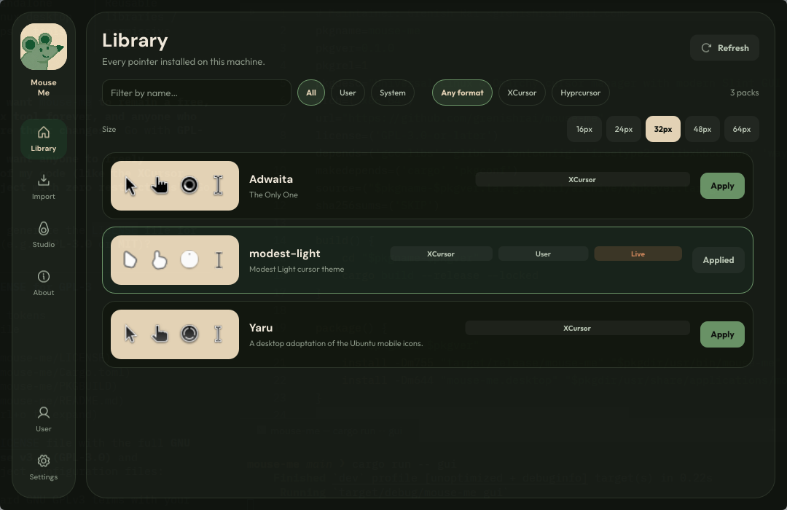

<div align="center">


<h1>Mouse Me</h1>
</div>

A cursor manager for Linux desktops (Hyprland, Omarchy, GTK, Qt, and X11). It includes a Slint GUI and a CLI in one binary.



## Build

```bash
git clone https://github.com/Grenish/mouse-me.git
cd mouse-me
cargo build --release
```

The binary is `target/release/mouse-me`.

```bash
sudo install -Dm755 target/release/mouse-me /usr/local/bin/mouse-me
install -Dm644 mouse-me.desktop ~/.local/share/applications/mouse-me.desktop
```

## Usage

GUI:

```bash
mouse-me
mouse-me gui
```

CLI:

```bash
mouse-me list
mouse-me list --json
mouse-me get
mouse-me set modest-light
mouse-me set modest-light 32
mouse-me add ~/Downloads/cursors.zip
mouse-me remove MyCustomCursor
```

`set` applies the theme and size across Hyprland, GTK, Qt, X11, and the user environment.

## License

GPL-3.0-or-later. See [LICENSE](LICENSE).
